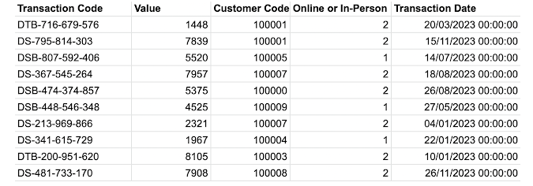
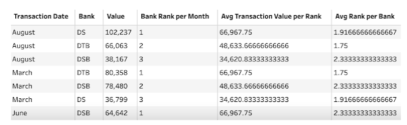
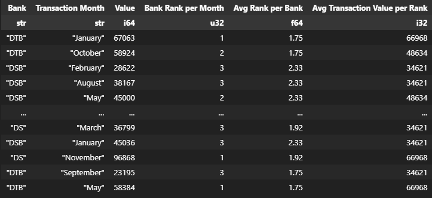

# DSB Ranking

[Challenge Link](//preppindata.blogspot.com/2023/02/2023-week-5-dsb-ranking.html)

## Input

## Requirements

* Input data
* Create the bank code by splitting out off the letters from the Transaction code, call this field 'Bank'
* Change transaction date to the just be the month of the transaction
* Total up the transaction values so you have one row for each bank and month combination
* Rank each bank for their value of transactions each month against the other banks. 1st is the highest value of transactions, 3rd the lowest. 
* Without losing all of the other data fields, find:
* The average rank a bank has across all of the months, call this field 'Avg Rank per Bank'
* The average transaction value per rank, call this field 'Avg Transaction Value per Rank'
* Output the data

## Data Structure

One file

6 data fields:
* Transaction Date
* Bank
* Value
* Bank Rank per Month
* Avg Transaction Value per Rank
* Avg Rank per Bank

36 rows (37 rows incl. headers)

## Output

Expecting Output

## Solution

Notebook [Data Prep](data-prep.ipynb)

